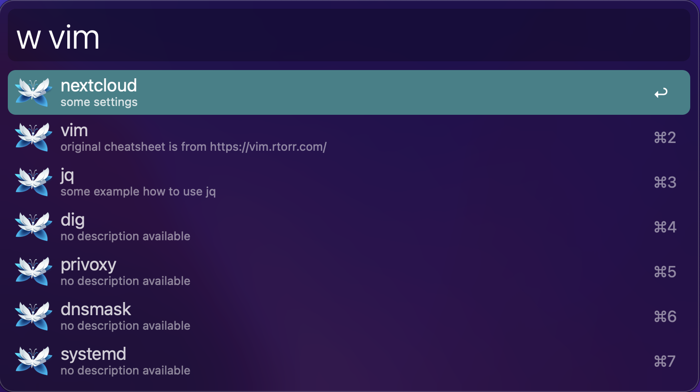

# Alfred workflow - search wikijs

[Alfred](https://www.alfredapp.com) workflow to search articles of your [wikijs](https://js.wiki).

## requirements

- [jq](https://github.com/stedolan/jq)

## variables

When importing this workflow, you have to set the following variables:

| variable     | description           | example                  |
| :----------- | :-------------------- | :----------------------- |
| WIKIJS_URL   | URL to wikijs         | https://wiki.example.com |
| WIKIJS_TOKEN | wikijs access token * | VERY-LONG-TOKEN          |

\**to create a wikijs access token goto `Administration` => `API Access` => Add `NEW API KEY`*

## preview

